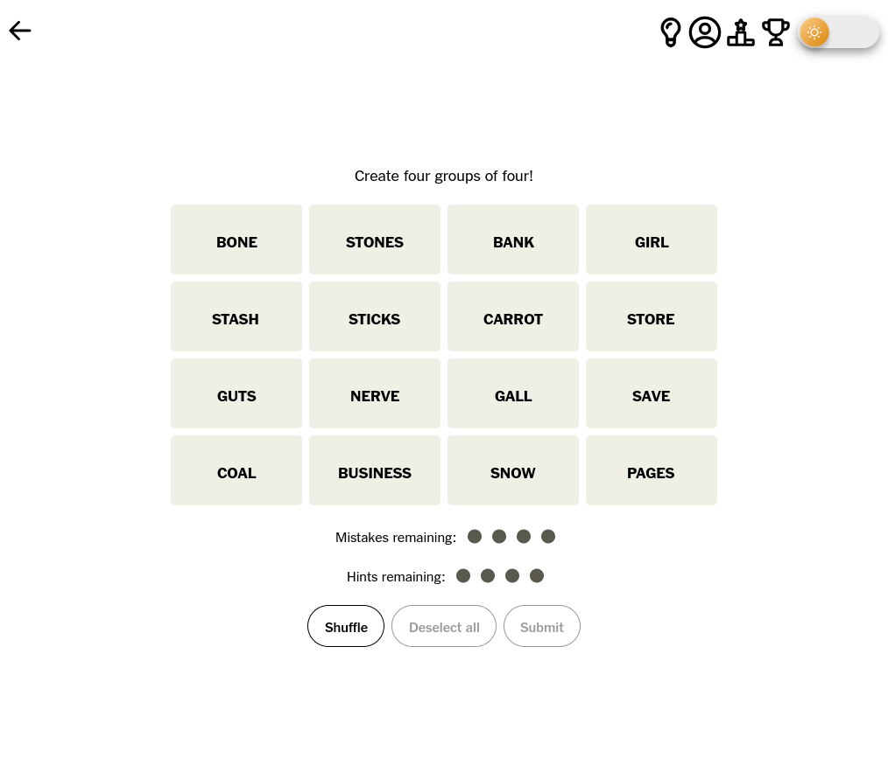
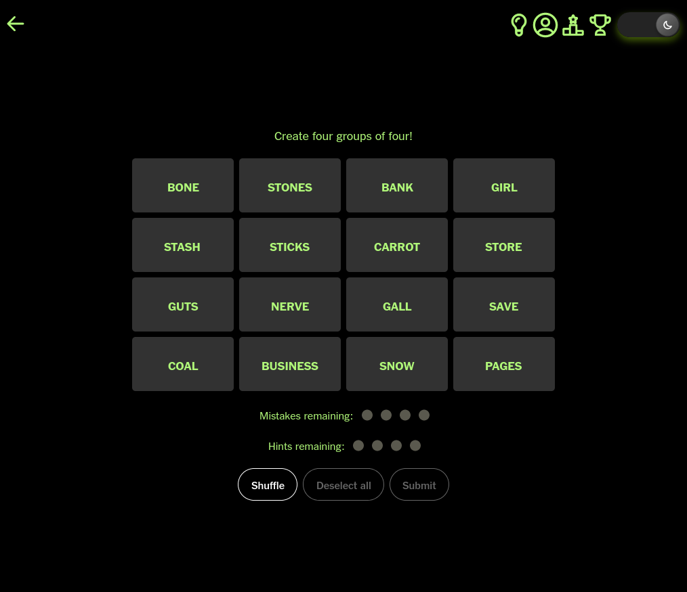
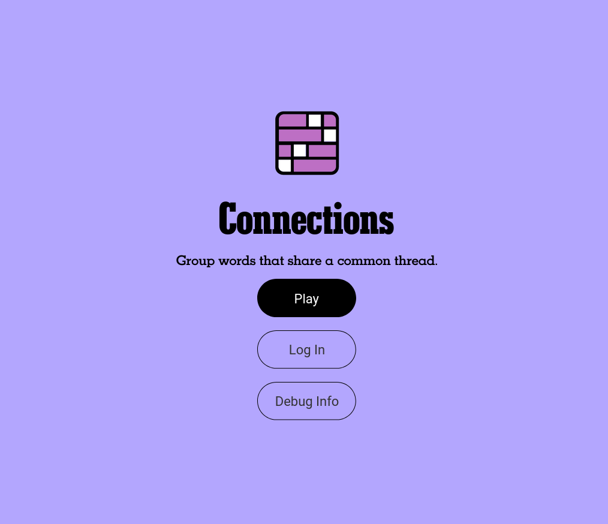
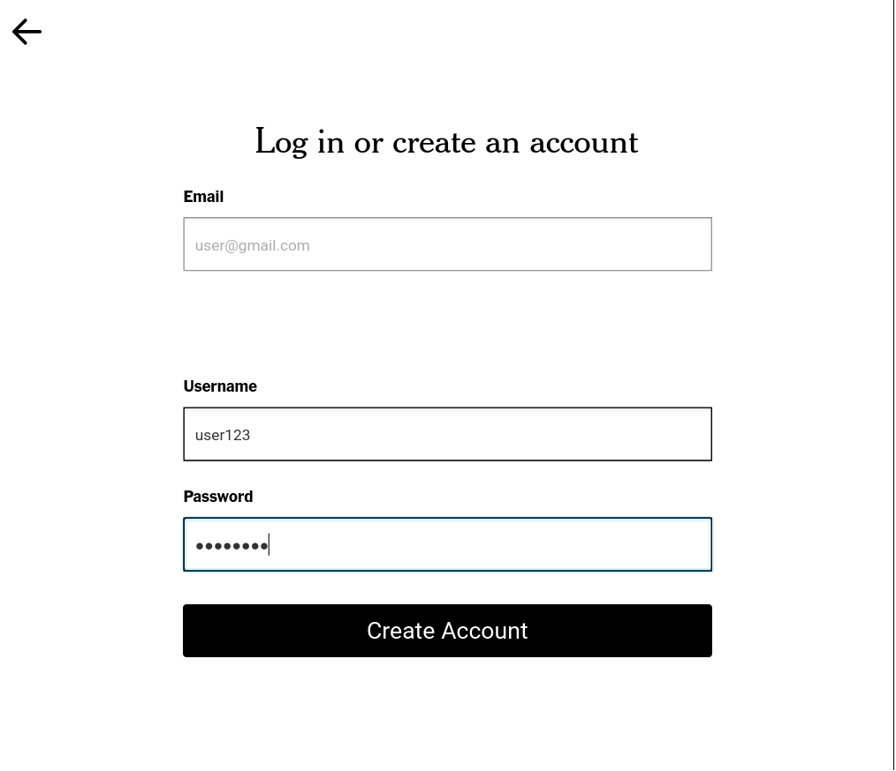
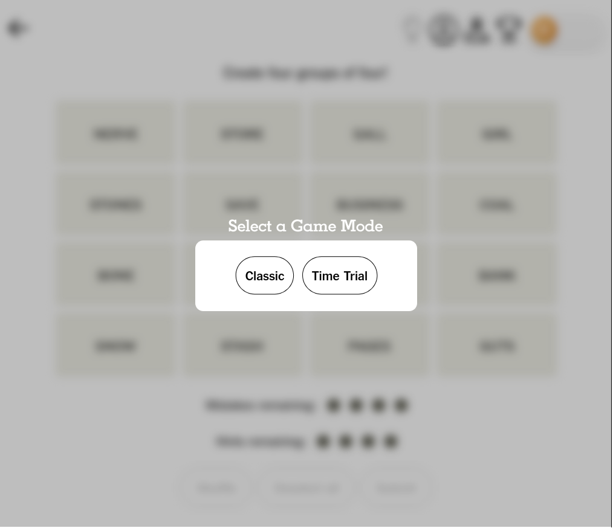
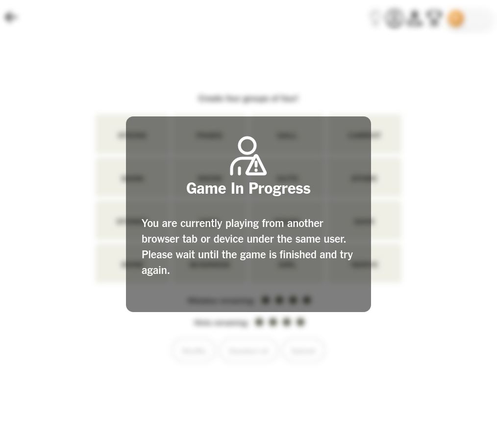

# CSC 335 Final Project: New York Times' Connections





**This project was created by Eiza Stanford, Ethan Wong, Hayden Roberts, and Jose Antonio.**

# Installation Guide
Our Connections implementation is designed to run in the web browser. It can be ran either in a standalone web server or locally on your computer. However, this means that Eclipse CANNOT be used to run the main project itself (only the JUnit tests). We have a guide on how to install the necessary software to run Connections locally.

## Running Connections Locally
Connections requires **Apache Maven** and **MongoDB** to be installed. We will provide instructions for Mac OS. This was tested with **Maven 3.9.6** and **MongoDB Community Edition 7.0.8**.

### Installing Maven
These instructions were taken from this [Digital Ocean Article](https://www.digitalocean.com/community/tutorials/install-maven-mac-os).
* Go to the [Apache Maven Downloads Page](https://maven.apache.org/download.cgi), download the **Binary tar.gz archive**, and extract it wherever you would like.
* We will need to be able to run the Maven `mvn` command. To do this, you will need to add Maven to your path. In your `.bash_profile` or whatever shell configuration file you have, paste the following and adjust `M2_HOME` to reflect where Maven is installed on your system:
```
export M2_HOME="/players/pankaj/Downloads/apache-maven-3.6.3"
PATH="${M2_HOME}/bin:${PATH}"
export PATH
```
* Verify that Maven works by running `mvn -version`.

### Installing MongoDB
These instructions were taken from this [MongoDB Guide](https://www.mongodb.com/docs/manual/tutorial/install-mongodb-on-os-x/).
* First get the Homebrew Tap with `brew tap mongodb/brew`.
* Then run `brew update`.
* Then install with `brew install mongodb-community@7.0`.
* Then start the database with `brew services start mongodb-community@7.0`.
* Whenever you are finished running Connections, you can stop the database with `brew services stop mongodb-community@7.0`.

### Cloning the Repo and Running
* First clone this [GitHub repository](https://github.com/CSC335/empty-repo-haydenjoseeizaethan).
* In the repo folder, for the first time running Connections, run `mvn clear` followed by `mvn compile` to run Connections.
* Any subsequent run will only require running `mvn jpro:run` to run Connections.
* However, if any changes are made to the code, rerun `mvn compile` before `mvn jpro:run` if you would like these changes to be realized.
* In a web browser, connect to the URL `localhost:8080`.
* Once you are finished with the game, hit **Ctrl-C** in the terminal where JPro is running.
* **NOTE**: Make sure that MongoDB is running on your system BEFORE you start Connections!
* **NOTE**: Be careful that you do NOT hit **Ctrl-C** while in a game (non-graceful shutdown)!
	* Only use it if you are currently at the Connections home screen (graceful shutdown).
	* Otherwise Connections will display the "Game In-Session" error message even if you are not currently in a game.
 * **NOTE**: The "Share Results" button was verified to work and actually copy to your clipboard when we ran Connections locally before it was ported to the web browser, but JPro does not support copying to clipboard in the web browser, so the feature does not work in the web browser.

# Player Guide Game Rules

## The Basics

### What is it About
This project is based on the NYT Connections, a puzzle game where, given a 4x4 grid of words, the player must group 4 words together that fall under the same theme or category for 4 categories in total. The four categories also represent different levels of difficulty for grouping the words together, which are indicated by their color: yellow (easiest), green (easy), blue (hard), purple (hardest). The selected words do not need to follow a specific physical path or order on the board, as they will automatically arrange themselves into a row: as categories are found, their larger tiles are positioned towards the top of the board and begin filling up the board from top to bottom. When the player finds all categories, there will be 4 large category tiles with the colors that represent their difficulty.

### Daily Puzzles
There is a new puzzle each day. If the Connections game is ran in a web server, the server will automatically switch to a new game after a day. The player can only complete the puzzle for that day: once they win or lose, they will only be able to view the results of the puzzle until the next day.

## Home Screen and Login





When the player first loads up Connections in their browser, they can do the following:
* **Play**: When the player is ready to start a new game (or view a finished one), they can hit the **Play** button. The player can either play as a **Guest** (signed out) or with an **Account** (signed in).
* * **Login**: If the player is signed out, they will see this button. When clicking the **Login** button, they can either create a new account or log into an existing one. An account has an email, username, and password.
* **Logout**: If the player is signed in, they will see this button. When clicking the **Logout** button, they will no longer be in an account and will be considered as a guest.

### Cookies
Once a player is signed in, their session will be stored as a cookie. All sessions expire after 7 days (or whatever it is set to in the app), which will forcefully log the player out. After logging out, an account remains intact, but a guest is removed from the database.

### Guest vs. Account
A **Guest** generally can do anything that an **Account** can do, except for these cases:
* A Guest does not have a username, email, or password.
* A Guest cannot view their profile.
* A Guest cannot appear on the leaderboard.
* A Guest is cleared from the database once the cookies expire. The only way to permanently save progress is to make an account.

## In the Game

### Choosing a Game Mode



Connections offers two main game modes: **Classic** and **Time Trial**. The **Classic** mode is just like regular Connections as it is on New York Times' website. The **Time Trial** forces a player to complete within one minute and will stop the player once time runs out.

### Main Buttons and Interaction
* **Selecting Words**: The player can select words by clicking on them directly in the board, but they can only select up to 4 words.
* **Submit**: Only when the player has 4 words selected, they can submit their guessed group of words and see if it is correct or not.
* **Shuffle**: The player can randomize the arrangement of the words on the grid by clicking the **Shuffle** button.
* **Deselect**: The player can deselect their selected words by clicking on the **Deselect** button, which means that no words will be selected afterwards.

### Menu Buttons
* **Back**: The player can return back to the home screen.
* **Hints**: The player can use a hint to see some answers in the board.
* **Achievements**: The player can view the achievements they earned.
* **Leaderboard**: The player can see the top players and their score.
* **Profile**: The player is logged into an account, they can edit their username, email, and password.
* **Dark Mode**: The player can toggle dark mode for their game. The dark mode setting is saved for both accounts and guests when they leave and come back.

### Mistakes
A player can make up to **4 mistakes** in a game. Once they run out of remaining mistakes, the game will auto-solve itself until all the answers have been found.

### Hints
A player also has **4 hints** in a game. Here is what happens when the player uses a hint:
* The hint helps the player by highlighting word tiles with their category color.
* The hint highlights the currently selected words and 3 additional words based the colors of the selected words. For every selected color, there will be one additional tile with that same color, guaranteed.

### Leaving Mid-Game
When a player leaves mid-game, their game is saved into the database so that it is loaded back in when they come back to Connections. Their saved game includes the arrangement of words in the grid, mistakes, hints, and guesses.

### Joining From Another Tab



To prevent the same player from cheating or breaking the game by having multiple games open simultaneously, Connections will require that the player only have one game open at a time (and any additional tab that is opened will display an error message).

**NOTE**: JPro One, the library that allows us to have JavaFX in the web browser, is not perfect and may mistakenly think that a player has not closed their browser. JPro One may not be entirely compatible with all browsers and systems.

# Design Choices and WOW Factors

## From a Glance
* We used JPro to make Connections run in a web browser. This means that a web server that has JPro running can host Connections and allow anyone with a web browser to play the game (instead of installing Eclipse, importing the package, and performing a lot of effort just to play the game).
* We used MongoDB to organize the game and player data instead of serialization, which uses JSON-style entries to store data. Without relying on serialization, we can store information in plain-text that can be read by any other app in the future.
* Since MongoDB does NOT support schemas or ways of having standardized "objects" like a player or game in the database, we created our own Java classes and interfaces that standardize the process of converting an object to and from a database-ready (JSON) format, reading and writing an object to and from the database, and reliably removing or checking for the existence of an object.
    * This means that it is extremely easy to interact with the database. In the code, the current player is stored as a `WebUser`, has traditional getters and setters like any Java object, can update its local instance variables with `readFromDatabase()`, and update the database copy with `writeToDatabase()`.

## Website Features
* **Guests**: Connections does not force players to use accounts.
* **Cookies**: Connections keeps people logged in with Cookies in their web browser.
* **Safe and Secure Sessions**: Connections does NOT store the username, password, or any sensitive information in cookies. It only stores the session ID. This means that players cannot extract credentials from others' cookies, forcefully keep a session alive (past cookie expiration), etc.
* **Save States**: Connections ensures that players that leave mid-game can have their current game progress saved and restored when they return.
* **Single-Session Games**: While multiple players can be logged into the same account simultaneously, they cannot play the current game simultaneously. This is to ensure that players cannot break Connections or cheat in some way.
